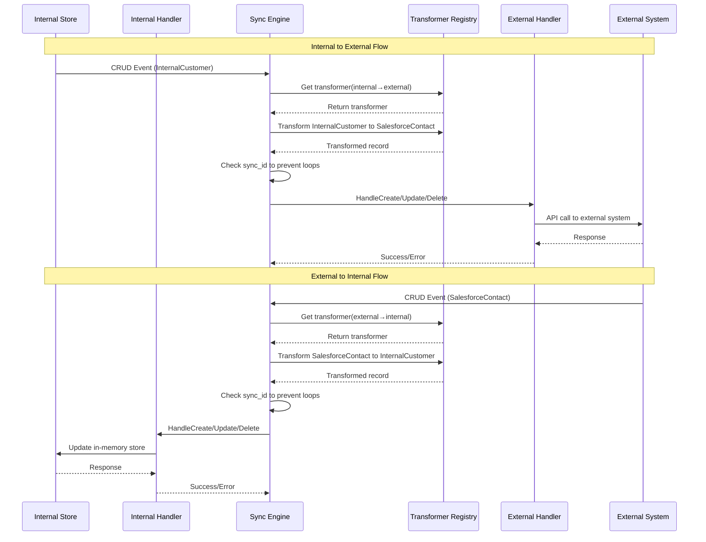

# Record Synchronization Service

A bi-directional record synchronization service that handles CRUD operations between different CRM systems:
- **Internal System**: In-memory storage with direct access
- **External Systems**: API-based access (e.g., Salesforce) with potential rate limits

## Overview

This service provides a flexible and extensible way to synchronize records between different CRM systems. Key features:

- Bi-directional synchronization with configurable rules
- Extensible design for adding new CRM systems
- Schema transformation between systems
- Prevention of infinite sync loops
- Support for create, read, update, and delete operations
- Fallback to local cache when external APIs are unavailable

## Architecture

## Defined Scope

This service is scoped to handle bi-directional sync between internal and external systems. We are only doing it for one crm for now, but the code is written extensibly to handle multiple crms. We are not looking at conflict resolution at this point.

## Solution

In this repo, we have models, which has records for internal and external systems. We have transform folder which has transformers for each source-target combination. 

We have sync folder having the core logic of handling the queued events, processing them and sending them to the target system.

We have system folder which has handlers.go which implements the SyncHandler interface.

SyncHandler interface has HandleCreate, HandleUpdate and HandleDelete methods. HandleRead isn't needed in this since it is not needed for bi-directional sync.

We have external system handlers which implement the SyncHandler interface. These handlers are responsible for making the actual call to the external system to update the record. 

We also have rules engine to determine which events needs to be informed to which of the handlers.
This is part of the sync engine and determined by the sync rule struct.

We have internal system handlers which implement the SyncHandler interface. These handlers are responsible for updating the internal system which is basically updating the in memory data structures.

Flow of events:

## Design Decisions

### Registry Pattern
- Transformers are registered for each source-target combination
- Each transformer handles the conversion of records between two specific systems
- New transformers can be added without modifying existing code

### Handler Pattern
- Each system (internal/external) has its own handler implementing the SyncHandler interface
- Handlers encapsulate system-specific logic for CRUD operations
- New systems can be added by implementing the handler interface

### Event-Driven Architecture
- Changes in any system generate sync events
- Events are processed asynchronously by the sync engine
- Each event includes metadata to prevent infinite loops

## How It Works

1. **Change Detection**
   - Systems generate sync events for any CRUD operation
   - Events include source system, operation type, and record data

2. **Sync Engine**
   - Processes events based on configured rules
   - Determines target systems for each event
   - Prevents infinite loops using "reconcile-" prefix in sync IDs

3. **Record Transformation**
   - Registry looks up appropriate transformer for source-target pair
   - Transformer converts record between system-specific formats
   - Each system maintains its own schema and data model

4. **External System Integration**
   - Mock API server simulates external CRM systems
   - Supports rate limiting and error handling
   - Local cache provides fallback when API is unavailable

## Assumptions

We are using mock external api server to simulate external crm systems.

We are using in memory data structures to store the data instead of any external storage.

We are using go channels to simulate kafka.

We are using mutex to simulate row locking in the database to prevent race conditions.

We are using in memory data structures to store what has been processed already.

We are not using multiple queues for different types of events.

Please refer to the docs section to understand the alternatives considered and the design choices made.

## Testing 

We have crm sync testing where we are testing the one way sync between internal and external systems. Whenever we are creating internal customer it gets updated in the external systems.

We have webhook testing where we are testing the one way sync between external and internal systems. Whenever we are creating external customer it gets updated in the internal systems by the webhook. We are assuming that the external system is sending the webhook to the service and that propagates to the internal and the internal system can decide where to send the updates by the rules.

## Running the tests

go test -v ./tests/integration/...

