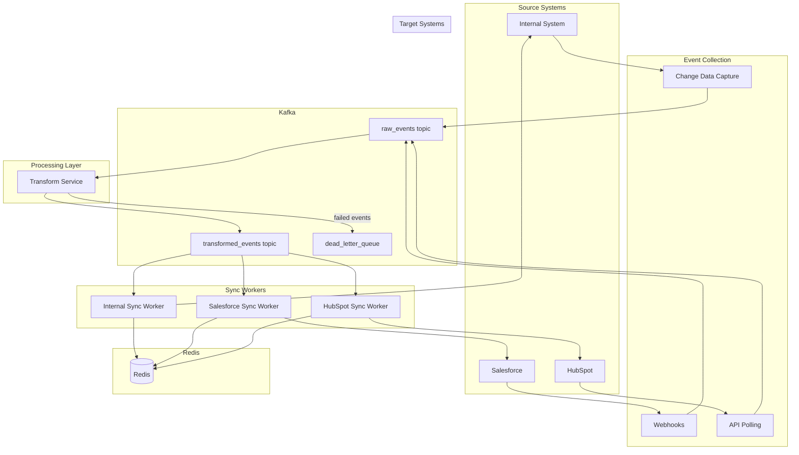

# Production Architecture for Record Sync Service 

This doc explains our approach to building a reliable sync service.


## System Architecture



### 1. Kafka
Kafka handles three types of events:
- Raw events: The original updates from any CRM
- Transformed events: Events that have been translated for their destination
- Problem events: Things that need human attention (sort of dlq)

We sort these events by where they came from and what type of record they are, making it easy to process similar things together.

### 2. Systems
We have two types of systems that watch for changes:

**Internal System:**
- Watches our database for changes (change data capture)
- Tags each change with important details like sync id, source, operation type, record type, record data
- Sends it to Kafka topic raw_events

**External Systems:**
- Regularly checks external APIs for changes
- Also accepts webhooks for changes
- Tags each change with important details like sync id, source, operation type, record type, record data
- Sends it to Kafka topic raw_events

### 3. Transformation Layer
Our transformation layer is responsible for converting events to the right format:
- Picks up raw events
- Converts them to the right format
- Sends them on their way into a Kafka topic transformed_events

### 4. Event Consumer Layer
Each event consumer is responsible for handling events from a specific CRM system:
- Consumes the transformed events from Kafka topic transformed_events based on the source and record type filters.
- They handle retries when things fail (can make use of hystrix/circuit breaker)
- They make sure not to overwhelm any system (rate limit is in place)
- They also make sure to update the redis to remember what they've processed.
- Then they make the actual call to the external system to update the record.

### 5. Redis 
- Remembers what we've processed (no duplicate deliveries!) by using sets to store the sync ids of the processed events.
- Saves frequent lookups for quick access by using sets to store the sync ids of the processed events.

## How Can We Prevent Infinite Loops?

### Event
```json
{
  "id": "evt_123",
  "from": "salesforce",
  "what": "update",
  "record": { ... },
  "sync_id": "sync_123",
  "metadata": {
    "origin": "internal",
  }
}
```

## What Can Go Wrong in the above design?

we heavily dependent on kafka which can be a SPOF (single point of failure) so we need to make sure we have scaled kafka with multiple brokers and have a backup plan in place.

## Other approaches considered.

### 1. Direct System-to-System via websocket or API calls
Pros: 
- Simpler to build

Cons:
- No history, hard to scale, can't replay
- No store for the events.

### 2. Database Level Sync
Pros: 
- Super fast
Cons: 
- Too tightly coupled, hard to change
- Need to know the schema, hard to replay or track progress.

### 3. Batch Processing
Pros: 
- Good for big updates
Cons: 
- conflict resolution is much harder and not atomic so we need to be careful.
